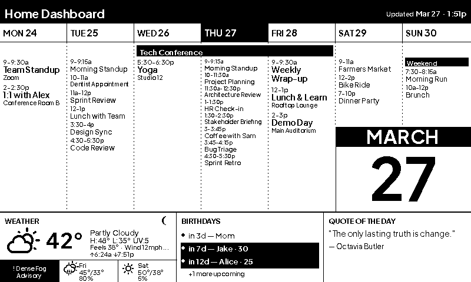
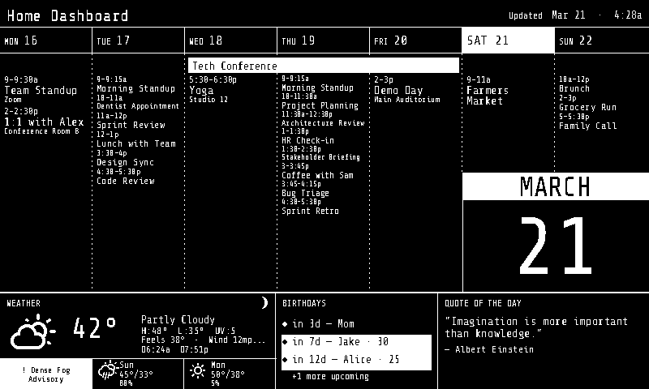
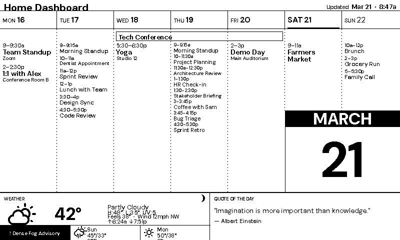
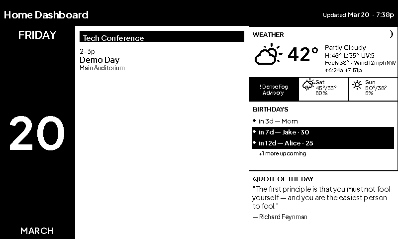
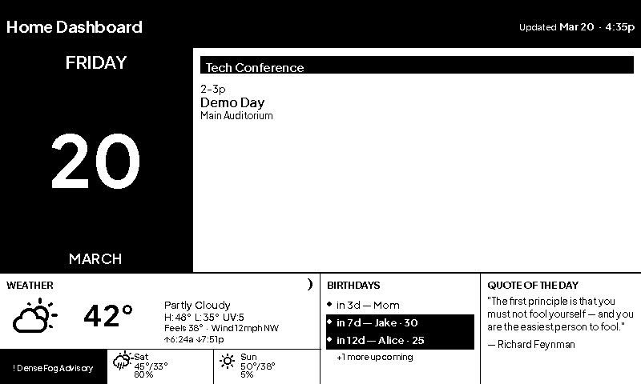

# Home Dashboard

A Python-based eInk dashboard for Raspberry Pi that displays your week's calendar events,
current weather, upcoming birthdays, and a daily quote — on any supported Waveshare eInk
display (black & white).



---

## Themes

Version 3 introduces a full theme system. Themes are not limited to colors or fonts —
each one can define an entirely different layout, moving components to different positions,
changing proportions, and removing sections entirely. Switch themes with a single line in
`config.yaml`:

```yaml
theme: cyberpunk   # default | cyberpunk | minimalist | old_fashioned | today
```

### default

The classic layout. Black text on white. Filled black header, today column, and all-day
event bars. 7-day calendar grid takes center stage.


### cyberpunk

Same geometry as default, but the canvas is **black** with white text throughout.
Today's column pops with an inverted white-fill/black-text block. Tighter event spacing
packs more information into the same space.



### minimalist

A slimmer 30px header gives the calendar more vertical room (340px vs 320px). All-day
events render as outlined bars instead of filled blocks. Section labels use regular weight.
Generous spacing between events for a cleaner, less busy look.



### old_fashioned

Structural rearrangement: the 7-day calendar occupies the full left 62% of the screen.
Weather, birthdays, and the daily quote stack vertically in the right column. A taller,
more formal 56px header. Placeholder for an optional serif font.



### today

Focused single-day view. The 7-day grid is replaced by a large inverted date panel
(day name, 90pt date number, month) on the left and a spacious event list on the right
— large fonts, full time ranges, and locations all visible without squinting. Taller
60px header and 140px bottom strip. Ideal for a kitchen or desk display where the
current day's schedule matters more than the full week.



### Creating your own theme

Adding a new theme requires two steps — no changes to any component code:

**1. Create `src/render/themes/<name>.py`:**

```python
from src.render.theme import ComponentRegion, Theme, ThemeLayout, ThemeStyle

def retro_theme() -> Theme:
    return Theme(
        name="retro",
        layout=ThemeLayout(
            canvas_w=800, canvas_h=480,
            # Calendar on the left, info panels stacked on the right
            header=ComponentRegion(0, 0, 800, 48),
            week_view=ComponentRegion(0, 48, 540, 432),
            weather=ComponentRegion(540, 48, 260, 144),
            birthdays=ComponentRegion(540, 192, 260, 144),
            info=ComponentRegion(540, 336, 260, 144),
        ),
        style=ThemeStyle(
            invert_header=True,
            invert_today_col=True,
            invert_allday_bars=False,   # outlined all-day bars
            spacing_scale=1.1,
            label_font_size=11,
            label_font_weight="semibold",
        ),
    )
```

**2. Register it in `src/render/theme.py`:**

```python
# In load_theme():
if name == "retro":
    from src.render.themes.retro import retro_theme
    return retro_theme()

# In AVAILABLE_THEMES:
AVAILABLE_THEMES: frozenset[str] = frozenset(
    {"default", "cyberpunk", "minimalist", "old_fashioned", "retro"}
)
```

Then preview it instantly with no config file:

```bash
python -m src.main --dry-run --dummy --config /dev/stdin <<'EOF'
theme: retro
display:
  model: "epd7in5_V2"
weather:
  api_key: "dummy"
  latitude: 40.7128
  longitude: -74.0060
google:
  service_account_path: "credentials/service_account.json"
  calendar_id: "dummy@group.calendar.google.com"
EOF
# open output/latest.png
```

**ThemeStyle reference:**

| Field | Type | Default | Effect |
|---|---|---|---|
| `fg` | `int` | `0` (black) | Foreground color for text and lines |
| `bg` | `int` | `1` (white) | Canvas background color |
| `invert_header` | `bool` | `True` | Fill header bar with `fg`, draw text in `bg` |
| `invert_today_col` | `bool` | `True` | Fill today's column header with `fg` |
| `invert_allday_bars` | `bool` | `True` | Solid-fill all-day event bars vs. outlined |
| `spacing_scale` | `float` | `1.0` | Multiplier on event row spacing (>1 = more breathing room, <1 = tighter) |
| `label_font_size` | `int` | `12` | Point size for "WEATHER" / "BIRTHDAYS" / "QUOTE" section labels |
| `label_font_weight` | `str` | `"bold"` | Font weight for section labels: `"bold"`, `"semibold"`, or `"regular"` |
| `font_regular` | callable | Plus Jakarta Sans Regular | Override with any `(size) -> FreeTypeFont` function |
| `font_medium` | callable | Plus Jakarta Sans Medium | |
| `font_semibold` | callable | Plus Jakarta Sans SemiBold | |
| `font_bold` | callable | Plus Jakarta Sans Bold | |

To hide a component entirely, set `visible=False` on its `ComponentRegion`:

```python
info=ComponentRegion(550, 360, 250, 120, visible=False)
```

For full details see the **Theme System** section in [`CLAUDE.md`](CLAUDE.md).

---

## Features

### Display & Rendering

- **Weekly calendar view** — 7-day grid (Mon–Sun) with timed and all-day events from
  Google Calendar; event locations shown below each title; per-day busy-ness dots and
  forecast icons in column headers
- **Multi-day spanning events** — all-day events spanning multiple days render as
  continuous bars across columns rather than repeated per-day
- **Adaptive event density** — automatically switches between normal, compact, and dense
  rendering tiers based on event count; busy days use smaller fonts and tighter spacing
  to fit more events before showing "+N more"
- **Weather panel** — current conditions, high/low, wind speed with compass direction,
  UV index, 3-day forecast strip, active weather alerts, and moon phase icon via
  OpenWeatherMap
- **Extended forecast** — up to 6 days of forecast data; small weather icons appear in
  each week-view day header for a unified week-at-a-glance
- **Moon phase** — pure-math lunar phase calculation (no API needed)
- **Birthdays** — upcoming birthdays from a local JSON file, Google Calendar, or Google
  Contacts with countdown and milestone age display
- **Daily quote** — deterministic daily rotation from a configurable pool (125 default
  quotes spanning sci-fi, science, philosophy, and wit)

### Themes

- **Five built-in themes** — `default`, `cyberpunk`, `minimalist`, `old_fashioned`, `today`
- **Fully structural** — themes can reposition components, change proportions, and hide
  sections, not just swap colors
- **Two-line setup** — create a factory function + register a name; no component code
  changes required
- **Custom fonts** — supply any `(size) -> FreeTypeFont` callable in `ThemeStyle` to use
  a different typeface per theme

### Data & Caching

- **Per-source fetch intervals** — configurable refresh intervals per data source;
  skips API calls when cached data is still fresh
- **Cache TTL with staleness gradation** — FRESH → AGING → STALE → EXPIRED; expired
  data is discarded rather than displayed; header shows `! Stale` indicator
- **Event filtering** — hide events by calendar name, keyword, or all-day status without
  removing them from cache
- **Incremental calendar sync** — only changed events downloaded after the first fetch,
  reducing Google Calendar API quota usage
- **Parallel data fetching** — calendar, weather, and birthday calls run concurrently

### Reliability

- **Circuit breaker** — backs off automatically after N consecutive failures; single
  probe request after cooldown; resets on success
- **API quota awareness** — daily request counter per source with configurable warning
  thresholds; auto-resets each day
- **Conditional display refresh** — SHA-256 image diffing skips eInk updates when
  nothing changed, extending display lifespan

---

## Hardware

- Raspberry Pi (any model with SPI) — Pi Zero 2 WH recommended
- A supported Waveshare eInk display connected via the 40-pin GPIO HAT

See the [Bill of Materials](#bill-of-materials) below for specific part recommendations.

---

## Bill of Materials

A minimal build (Pi Zero 2 W + 7.5" display) runs **~$65–75** all-in.

### Required

| Component | Recommended | Notes | Approx. Price |
|---|---|---|---|
| **Raspberry Pi** | [Pi Zero 2 WH](https://www.raspberrypi.com/products/raspberry-pi-zero-2-w/) | Buy the **WH** variant (with headers) to avoid soldering. | $15 |
| | [Pi 4 Model B (2 GB)](https://www.raspberrypi.com/products/raspberry-pi-4-model-b/) | If you already own one or want headroom for other tasks | $45 |
| **eInk display** | [Waveshare 7.5" HAT V2](https://www.waveshare.com/7.5inch-e-paper-hat.htm) (800×480, B&W) | The default `epd7in5_V2` model. Plugs directly onto the Pi's 40-pin GPIO header. | ~$30–35 |
| **MicroSD card** | SanDisk Ultra 32 GB or Samsung Evo Select 32 GB | Class 10 / A1 minimum. | ~$8–10 |
| **Power supply** | [Official Pi Zero PSU](https://www.raspberrypi.com/products/micro-usb-power-supply/) (5 V 2.5 A, micro-USB) | Use the [USB-C PSU](https://www.raspberrypi.com/products/type-c-power-supply/) for Pi 4. | ~$8–12 |

### Optional

| Component | Notes | Approx. Price |
|---|---|---|
| **Picture frame** | A standard 7"×5" or 8"×6" frame can be modified to seat the display panel | ~$10–20 |
| **3D-printed stand** | Search "Waveshare 7.5 eink frame" on Printables / Thingiverse | Free |
| **Short micro-USB cable** | For routing power inside a frame or enclosure | ~$5 |

### Display model alternatives

| Model | Resolution | Notes |
|---|---|---|
| `epd7in5` | 640×384 | V1 (older) |
| `epd7in5_V2` | 800×480 | **Default / recommended** |
| `epd7in5_V3` | 800×480 | V3 variant |
| `epd7in5b_V2` | 800×480 | B/W/Red — codebase renders B&W only |
| `epd7in5_HD` | 880×528 | HD variant |
| `epd9in7` | 1200×825 | 9.7" |
| `epd13in3k` | 1600×1200 | 13.3" |

> Prices are approximate as of early 2026 and vary by retailer.

---

## Prerequisites

- **Python 3.9+** — `python3 --version`
- **git** — `git --version`
- **make** — pre-installed on macOS and most Linux; on Windows use WSL

---

## Quick Start

### 1. Clone and set up

```bash
git clone https://github.com/gkoch02/Dashboard-v3.git
cd Dashboard-v3
make setup
```

### 2. Configure

`make setup` creates `config/config.yaml` from the template. Open it and fill in:

| Field | What to put here |
|---|---|
| `display.model` | Your Waveshare model (see table above) |
| `google.service_account_path` | Path to your service account JSON (see [Google Calendar Setup](#google-calendar-setup)) |
| `google.calendar_id` | Your Google Calendar ID |
| `weather.api_key` | Your [OpenWeatherMap](https://openweathermap.org/api) API key (free tier) |
| `weather.latitude` / `longitude` | Your location |
| `weather.units` | `imperial` (°F) or `metric` (°C) |
| `timezone` | IANA timezone, e.g. `America/Los_Angeles`. Use `local` for system clock. |
| `theme` | *(optional)* `default`, `cyberpunk`, `minimalist`, `old_fashioned`, or `today` |

### 3. Preview

```bash
make dry
```

Renders `output/latest.png` with dummy data. To preview a specific theme:

```bash
venv/bin/python -m src.main --dry-run --dummy --config /dev/stdin <<'EOF'
theme: cyberpunk
display:
  model: "epd7in5_V2"
weather:
  api_key: "dummy"
  latitude: 40.7128
  longitude: -74.0060
google:
  service_account_path: "credentials/service_account.json"
  calendar_id: "dummy@group.calendar.google.com"
EOF
```

### 4. Run with live data

```bash
venv/bin/python -m src.main --config config/config.yaml
```

---

## Google Calendar Setup

You need a **Google service account** — a credential that lets the dashboard read your
calendar without interactive login.

### Step 1 — Create a Google Cloud project

1. Go to [console.cloud.google.com](https://console.cloud.google.com) and sign in
2. Click the project dropdown → **New Project** → give it a name → **Create**

### Step 2 — Enable the Google Calendar API

1. **APIs & Services → Library** → search **Google Calendar API** → **Enable**

### Step 3 — Create a service account

1. **APIs & Services → Credentials → + Create Credentials → Service account**
2. Give it a name (e.g. `dashboard-reader`) → **Create and Continue** → **Done**

### Step 4 — Download the key file

1. Click the service account → **Keys** tab → **Add Key → Create new key → JSON**
2. Move the downloaded file to `credentials/service_account.json`

> `credentials/` is git-ignored and will never be accidentally committed.

### Step 5 — Share your calendar

1. Copy the service account email (e.g. `dashboard-reader@your-project.iam.gserviceaccount.com`)
2. In [Google Calendar](https://calendar.google.com), click ⋮ next to your calendar →
   **Settings and sharing → Share with specific people → + Add people**
3. Paste the email, set **See all event details**, click **Send**

### Step 6 — Find your Calendar ID

1. In the same calendar settings, scroll to **Integrate calendar**
2. Copy the **Calendar ID** and paste it into `google.calendar_id` in `config.yaml`

---

## Birthday Configuration

Set `birthdays.source` in config to one of:

### `file` (default)

Create `config/birthdays.json`:

```json
[
  {"name": "Alice", "date": "1990-03-20"},
  {"name": "Bob",   "date": "07-04"}
]
```

Use `YYYY-MM-DD` to show age automatically, or `MM-DD` for name-only.

### `calendar`

Events on your Google Calendar containing the `calendar_keyword` (default: `"Birthday"`)
are read automatically — no extra setup.

### `contacts`

> Requires a **Google Workspace** (paid) account with admin access.

Birthdays from Google Contacts via the People API. Setup:

1. Enable the **People API** in Cloud Console
2. In [Google Workspace Admin](https://admin.google.com) → **Security → API controls →
   Manage domain-wide delegation → Add new**: enter the service account's client ID and
   scope `https://www.googleapis.com/auth/contacts.readonly`
3. Add to `config.yaml`:

```yaml
google:
  contacts_email: "you@yourdomain.com"

birthdays:
  source: "contacts"
```

---

## Deployment on Raspberry Pi

### Step 1 — Enable SPI

```bash
sudo raspi-config
# Interface Options → SPI → Yes → reboot
```

### Step 2 — Deploy the project

From your development machine:

```bash
make deploy
```

Rsyncs to `~/home-dashboard/` on `pi@raspberrypi.local` (adjust hostname in `Makefile` if needed).

### Step 3 — Set up the virtualenv on the Pi

```bash
sudo apt install swig liblgpio-dev
cd ~/home-dashboard
make setup
venv/bin/pip install -r requirements-pi.txt
```

### Step 4 — Install Waveshare display drivers

```bash
git clone https://github.com/waveshare/e-Paper ~/e-Paper
cd ~/home-dashboard
venv/bin/pip install ~/e-Paper/RaspberryPi_JetsonNano/python/
venv/bin/python -c "import waveshare_epd; print('OK')"
```

### Step 5 — Run once to verify

```bash
venv/bin/python -m src.main --config config/config.yaml
```

### Step 6 — Install the systemd timer

```bash
make install
ssh pi@raspberrypi.local "systemctl status dashboard.timer"
```

The timer fires every 30 minutes and the app handles all scheduling internally:

| Time window | Behaviour |
|---|---|
| First run at `quiet_hours_end` | Forced **full** eInk refresh |
| All other active hours | 30-minute partial-refresh polling (full every 6 partials) |
| `quiet_hours_start` → `quiet_hours_end` | Quiet — process exits immediately, no update |

Configure the window in `config.yaml`:

```yaml
schedule:
  quiet_hours_start: 23   # 11 pm
  quiet_hours_end: 6      # 6 am
```

---

## Development

```bash
make setup        # Create venv and install dependencies
make dry          # Dry-run render with dummy data → output/latest.png
make test         # Run test suite (pytest)
make check        # Validate config file and exit
make deploy       # rsync project to Raspberry Pi
make install      # Copy systemd timer/service to Pi and enable
```

### CLI flags

| Flag | Description |
|---|---|
| `--dry-run` | Save to PNG instead of pushing to display |
| `--dummy` | Use built-in dummy data (no API calls) |
| `--config PATH` | Path to config file (default: `config/config.yaml`) |
| `--force-full-refresh` | Force a full eInk refresh; bypasses fetch intervals and circuit breakers |
| `--check-config` | Validate config file and exit |

### Offline development

```bash
venv/bin/python -m src.main --dry-run --dummy
```

No API keys, credentials, or hardware needed.

---

## Advanced Configuration

### Cache TTL and Fetch Intervals

```yaml
cache:
  weather_ttl_minutes: 60       # data older than 4x this is discarded (EXPIRED)
  events_ttl_minutes: 120
  birthdays_ttl_minutes: 1440
  weather_fetch_interval: 30    # skip API call if cache is younger than this
  events_fetch_interval: 120
  birthdays_fetch_interval: 1440
```

Cached data progresses through **FRESH → AGING → STALE → EXPIRED**. The header shows
`! Stale` when any source reaches STALE.

### Event Filtering

```yaml
filters:
  exclude_calendars: ["US Holidays", "Spam Calendar"]
  exclude_keywords: ["OOO", "Focus Time", "Block"]
  exclude_all_day: false
```

Case-insensitive substring matching. Filtered events stay in the cache for incremental
sync correctness — they're only hidden at render time.

### Circuit Breaker

```yaml
cache:
  max_failures: 3        # consecutive failures before tripping
  cooldown_minutes: 30   # wait before sending a probe request
```

---

## Project Structure

```
Dashboard-v3/
├── config/
│   ├── config.example.yaml   # Copy to config.yaml and fill in secrets
│   └── quotes.json           # Daily quote pool (edit to customise)
├── credentials/              # Google service account JSON (git-ignored)
├── fonts/                    # Bundled TTF fonts
├── output/                   # Dry-run PNGs and cache (mostly git-ignored)
├── src/
│   ├── main.py               # Entry point + fetcher orchestration
│   ├── config.py             # YAML → typed config dataclass
│   ├── filters.py            # Event filtering
│   ├── data/models.py        # Pure data model dataclasses
│   ├── display/              # Display drivers (DryRun + Waveshare) + conditional refresh
│   ├── fetchers/             # API integrations, cache, circuit breaker, quota tracker
│   └── render/
│       ├── canvas.py         # Top-level render orchestrator (theme-driven)
│       ├── layout.py         # Default pixel geometry constants
│       ├── theme.py          # Theme system: ComponentRegion, ThemeLayout, ThemeStyle
│       ├── themes/           # Built-in theme factories (cyberpunk, minimalist, old_fashioned)
│       ├── moon.py           # Pure-math moon phase
│       └── components/       # header, week_view, weather_panel, birthday_bar, info_panel
├── tests/                    # pytest suite (578 tests)
├── Makefile
├── requirements.txt
└── requirements-pi.txt
```

---

## Typography

| Font | Used for |
|---|---|
| [Plus Jakarta Sans](https://fonts.google.com/specimen/Plus+Jakarta+Sans) (Regular, Medium, SemiBold, Bold) | All UI text — header, labels, timestamps, event titles, weather details, quote |
| [Weather Icons](https://erikflowers.github.io/weather-icons/) | Weather condition icons and moon phase glyphs |

Custom fonts can be added per-theme via `ThemeStyle.font_*` callables — see [Creating your own theme](#creating-your-own-theme).

---

## Dependencies

- [Pillow](https://pillow.readthedocs.io/) — image rendering
- [google-api-python-client](https://googleapis.github.io/google-api-python-client/) — Google Calendar & Contacts
- [requests](https://requests.readthedocs.io/) — OpenWeatherMap API
- [PyYAML](https://pyyaml.org/) — configuration
- [RPi.GPIO](https://pypi.org/project/RPi.GPIO/) + [spidev](https://pypi.org/project/spidev/) — Raspberry Pi hardware (Pi only)
